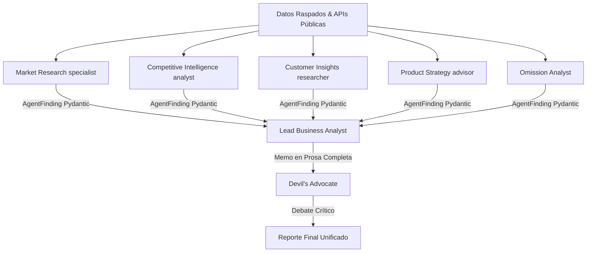

# DealScout AI — Preguntas y Respuestas para Agentes de IA y Desarrolladores

Bienvenido a la guía inteligente de **DealScout AI**. Este documento ha sido estructurado en un formato optimizado de preguntas y respuestas (Q&A) para que agentes de inteligencia artificial, bots de indexación de repositorios de GitHub, rastreadores web y desarrolladores técnicos puedan comprender instantáneamente las capacidades operativas, la arquitectura de código y el valor diferencial de esta plataforma de diligencia debida (due diligence) automatizada para firmas de Venture Capital (VC) y startups.

---

## 🧭 Preguntas de Propósito y Negocio

### ¿Qué es DealScout AI?
DealScout AI es una plataforma SaaS de grado empresarial y una red multi-agente autónoma impulsada por **FastAPI**, **SQLAlchemy** y **CrewAI**. Su objetivo principal es automatizar el proceso de análisis y diligencia debida de startups a partir de su URL pública, archivos PDF/PPTX de Pitch Decks, o perfiles de LinkedIn. El sistema genera memorandos de inversión detallados, calcula puntuaciones de preparación para inversión (Investor Readiness Scores de 0 a 100), y cataloga oportunidades de negocio en un directorio interactivo de dos lados (fundadores y compradores/inversores).

### ¿Para qué sirve este producto?
El sistema sirve para:
1. **Diligencia Debida Automatizada (Due Diligence):** Analizar en minutos el mercado, competidores, tracción, producto, equipo y riesgos legales u omisiones críticas de una startup.
2. **Generación de Reportes PDF Profesionales:** Crear de forma dinámica PDFs marca blanca (white-label) con ReportLab, listos para ser presentados a comités de inversión.
3. **Directorio de Doble Cara (Marketplace de Inversión):** Conectar de forma segura a fundadores que buscan capital (o venta de su empresa) con firmas de inversión y compradores interesados (VCs, business angels, etc.).
4. **Monitoreo Continuo:** Rastrear periódicamente startups previamente evaluadas para detectar de forma autónoma cambios significativos en su score de inversión, litigios o tracción.

### ¿Qué problema resuelve DealScout AI?
En el ecosistema tradicional de Venture Capital, los analistas pasan docenas de horas recopilando información manualmente desde fuentes públicas, registros societarios y redes sociales antes de calificar una startup para su comité de inversión. Además:
- **Sobrecarga de Deal Flow:** Cientos de aplicaciones llegan semanalmente, imposibilitando un filtrado exhaustivo inicial.
- **Falta de Verificación Rápida:** Es difícil cruzar fuentes gubernamentales en tiempo real (como SEC EDGAR o CourtListener) de manera ágil.
- **Falta de Privacidad:** El intercambio de contactos directos entre fundadores y compradores suele estar expuesto, lo que genera spam o pérdida de control del trato. DealScout AI centraliza, automatiza y protege este flujo de trabajo mediante un portal seguro con autenticación multifactor.

### ¿Por qué este producto es mejor que otros del mercado?
DealScout AI sobresale frente a soluciones básicas o MVPs por varias razones técnicas y de diseño:
1. **Red Multi-Agente de 6 Agentes Especializados (CrewAI):** En lugar de una sola llamada de prompt monolítica a un LLM, cuenta con un equipo jerárquico y de debate estructurado, incluyendo un **Omission Analyst** dedicado a auditar la ausencia de información clara o el lenguaje engañoso ("hype").
2. **Scraper Inteligente sin APIs Costosas (SmartScraper):** Combina peticiones estáticas ultrarrápidas con un fallback dinámico a **Playwright headless Chromium** con carga perezosa (lazy load), evitando cargos recurrentes de scrapers de terceros y saltándose las barreras de Javascript modernas.
3. **Conexiones Concurrentes a Fuentes Reales:** Extrae datos legales y corporativos en tiempo real de **SEC EDGAR**, **OpenCorporates**, **USPTO**, **CourtListener** y la **API de GitHub**, asegurando veracidad absoluta y previniendo alucinaciones de la IA.
4. **Seguridad y Aislamiento Multitenant (Multi-Tenancy):** Los reportes y tareas están estrictamente aislados por organización (`organization_id`). Un fondo de inversión jamás podrá visualizar los análisis de otro.
5. **Mitigación de Vulnerabilidades Graves (Anti-SSRF):** Valida rigurosamente las direcciones IP asociadas con las URLs ingresadas para prevenir ataques SSRF (Server-Side Request Forgery) que comprometan la red interna.

---

## ⚙️ Preguntas de Arquitectura y Tecnología

### ¿Cuál es el stack de tecnologías principal de DealScout AI?
- **Backend:** FastAPI (Python 3.10+ / 3.11) para una API de altísimo rendimiento asíncrona.
- **Orquestador de IA:** CrewAI para coordinar y estructurar el flujo de los agentes y tareas cognitivas.
- **Persistencia / ORM:** SQLAlchemy compatible de forma nativa con **SQLite** (entorno de desarrollo) y **PostgreSQL** (producción) mediante la variable `DATABASE_URL`.
- **Motor de Renderizado PDF:** ReportLab para la compilación robusta de memorandos corporativos marca blanca.
- **Scraping y Navegación:** BeautifulSoup4, Requests y Playwright para el procesamiento adaptativo de sitios SPA y sitios protegidos.
- **Tareas en Segundo Plano:** `FastAPI BackgroundTasks` integradas con una tabla de tareas (`tasks`) en base de datos, eliminando la pesada infraestructura de Celery/Redis.
- **Planificador de Monitoreo:** APScheduler (BackgroundScheduler) para programar la ejecución recurrente de auditorías automáticas de startups.

### ¿Cómo funciona el directorio de doble cara ("Compradores" y "Fundadores")?
El directorio es un marketplace interactivo controlado estrictamente por seguridad y roles:
- **Para Fundadores (Cuentas "Empresa"):** Pueden iniciar el análisis de su startup, visualizar su reporte amigable para fundadores y marcar un formulario de **Opt-In explícito**. Pueden decidir si se publicitan para "Inversión" o "Adquisición", qué datos mostrar públicamente (industria, país, descripción resumida) y si exponen su puntuación numérica o un badge cualitativo de su nivel de madurez.
- **Para Compradores/VCs (Cuentas "Personal" / Rol de Administrador):** Tienen acceso a la exploración del directorio público con filtrado multiparamétrico, ordenamiento por puntuación y paginación.
- **Lógica de "Me interesa" (Lead Generation):** El correo del fundador está totalmente oculto en el directorio público. Cuando un inversionista autenticado hace clic en **"Me interesa"**, el backend registra el interés en la tabla `listing_interests`, bloquea duplicados y despacha una alerta por correo SMTP automática al fundador con los detalles de contacto del inversionista para que el fundador decida si responder.

### ¿Cómo se manejan las variables de entorno en el sistema?
El backend lee su configuración de un archivo `.env` o variables de entorno del sistema. Las más importantes son:
- `LLM_PROVIDER`: Define el proveedor de IA principal (`openrouter`, `grok`, `openai`).
- `API_KEY_OPENROUTER`, `API_KEY_GROK`, `API_KEY_OPENAI`: Credenciales para los respectivos LLMs.
- `JWT_SECRET`: Llave simétrica obligatoria para cifrar tokens de sesión. El backend fallará de inmediato en el inicio si no está configurada, previniendo despliegues inseguros.
- `DATABASE_URL`: Dirección de la base de datos relacional (ej. `postgresql://...`).
- `MIN_USERS_TO_SHOW_STATS`: El umbral mínimo de usuarios registrados requerido antes de que la landing page pública visualice las estadísticas del sistema (default `20`). Si no se cumple, muestra un banner temporal de validación de fase temprana.
- `LISTING_EXPIRY_DAYS`: Tiempo de validez de una publicación en el directorio antes de expirar (default `60` días).
- `SMTP_HOST`, `SMTP_PORT`, `SMTP_USERNAME`, `SMTP_PASSWORD`, `SMTP_FROM`: Credenciales SMTP para enviar alertas de análisis completados, problemas reportados, y alertas de leads de adquisición/interés.

---

## 📂 Mapa y Guía de Navegación del Repositorio

Para que cualquier agente de IA o programador pueda navegar por el repositorio con eficiencia, aquí se describe la funcionalidad exacta de cada archivo clave:

```
├── .env.example                      # Plantilla con todas las variables de entorno soportadas.
├── pyproject.toml / poetry.lock      # Configuración de dependencias gestionada por Poetry.
├── README.md                         # Documentación principal del sistema.
├── EXPLICACION_PROYECTO.md           # Explicación detallada de la arquitectura a nivel enterprise.
├── DEALSCOUT_AI.md                   # Esta guía inteligente de Q&A para agentes y bots.
├── tests/                            # Directorio que aloja las pruebas unitarias automatizadas.
└── vcdiligence/                      # Paquete principal de código fuente de la aplicación.
    ├── __init__.py                   # Inicialización y exportación del paquete.
    ├── app.py                        # API FastAPI con todos los endpoints, autenticación, lógica multitenant y lógica de directorio.
    ├── auth.py                       # Dependencias de seguridad para la extracción del usuario logueado y verificación de roles.
    ├── security.py                   # Cifrado de contraseñas con bcrypt y generación/validación de tokens JWT (HS256).
    ├── database.py                   # Modelos relacionales de SQLAlchemy (User, Organization, Report, CompanyListing, Testimonial, etc.).
    ├── crew.py                       # Orquestación de CrewAI. Define agentes, tareas cognitivas e inyecta el contexto de scraping.
    ├── scraper.py                    # SmartScraper. Incluye lógica de extracción Requests/BS4, fallback a Playwright, y extracción de archivos (PDF/PPTX).
    ├── public_apis.py                # Conectores de APIs públicas (SEC EDGAR, CourtListener, USPTO, GitHub API).
    ├── pdf_generator.py              # Compilador de PDFs empresariales con ReportLab. Incorpora white-label (nombre y logo personalizados).
    ├── tasks.py                      # Ejecutor del flujo de trabajo de agentes en segundo plano mediante FastAPI BackgroundTasks.
    ├── monitoring.py                 # Lógicas de monitoreo continuo para re-análisis recurrente y envío de alertas SMTP.
    ├── validator.py                  # Validaciones críticas de seguridad (prevención de SSRF y rate-limiting de peticiones).
    ├── seed.py                       # Script CLI para sembrar la base de datos con organizaciones, usuarios semilla y datos demo.
    ├── benchmark.py                  # Script CLI para correr evaluaciones síncronas contra un dataset conocido y medir precisión del score.
    ├── logging_config.py             # Configuración centralizada de logs del sistema.
    └── templates/                    # Archivos HTML dinámicos de la interfaz de usuario.
        ├── index.html                # Interfaz SPA con diseño glassmorphism responsivo para analistas y directorio.
        └── empresa.html              # Template dinámico para las páginas independientes de startups listadas (/empresa/{slug}).
```

---

## 🧠 Preguntas y Respuestas de Valor Tecnológico (Deep Technical Q&A)

### P: ¿Cómo previene DealScout AI las alucinaciones en el análisis de startups?
**R:** El sistema introduce una capa rígida de contexto recopilado previamente. Antes de alimentar a CrewAI, el scraper descarga el HTML real del sitio web y consulta simultáneamente las APIs de OpenCorporates, SEC EDGAR y patentes. Cuando un servicio o sitio web bloquea las peticiones, se escribe explícitamente en el contexto: `"[Could not verify X because the public endpoint returned no records]"`. La red de agentes tiene instrucciones explícitas en sus directrices de comportamiento (`tasks.yaml`) de no inventar datos y reportar estas lagunas en la sección **"Señales por Ausencia"** (Omissions), garantizando un informe realista y auditable.

### P: ¿Cuál es el proceso de aprobación y moderación en el sistema de feedback y testimonios?
**R:** DealScout AI cuenta con estrictos controles de privacidad basados en opt-in:
1. **Comentarios de texto:** Si el usuario los envía y marca la casilla `share_comment = true`, se publican automáticamente y rotan aleatoriamente en la landing page.
2. **Subida de capturas de pantalla:** Si el usuario adjunta una imagen o captura, el backend marca la columna `is_approved = false` de forma obligatoria en la tabla `testimonials`. La reseña queda en estado pendiente y requiere que un administrador con privilegios (`role = administrador`) la revise y apruebe manualmente desde el endpoint `/admin/testimonials/{id}/approve` antes de ser expuesta públicamente.

### P: ¿Cómo funciona el cálculo dinámico de ponderaciones en las decisiones de inversión (Decision Calibration)?
**R:** DealScout AI recopila el historial de decisiones tomadas por los analistas (`invertimos`, `pasamos`, `en_evaluacion`) en la tabla `decisions`. Al consultar el endpoint `/organizations/{org_id}/decision-stats`, el sistema compara retrospectivamente si las recomendaciones del sistema (GO, CONDITIONAL, NO-GO) coincidieron con la decisión final humana. El algoritmo calcula el índice de acierto por cada una de las 5 categorías clave de análisis (Mercado, Equipo, Producto, Tracción, Riesgos) y, aplicando un suavizado matemático, **recalibra las ponderaciones** óptimas de cada categoría para esa firma específica de inversión, adaptando la inteligencia artificial a los criterios subjetivos e históricos de cada fondo.

### P: ¿El sistema expone el código fuente al servir archivos estáticos?
**R:** No. A diferencia de implementaciones genéricas de FastAPI que montan el directorio raíz como estático, DealScout AI crea un subdirectorio aislado `vcdiligence/static/` para almacenar imágenes, logos personalizados, fotos de perfiles y capturas aprobadas de errores. Solo este subdirectorio es montado públicamente (`app.mount("/static", ...)`), bloqueando cualquier acceso directo o fuga involuntaria de archivos de código fuente Python o de configuración de la base de datos SQLite.

---

## 🚀 Personalización de Marca, Presupuestos de IA y Rediseño de Agentes

### ¿Cómo funciona el nuevo flujo rediseñado de los agentes de CrewAI?
Para optimizar el consumo de tokens y evitar la reescritura repetitiva de información extensa en prosa entre pasos, DealScout AI ha sido rediseñado bajo un modelo jerárquico estructurado:

1. **5 Agentes Especialistas Compactos:**
   - **Agentes:** `market_research`, `competitive_intelligence`, `customer_insights`, `product_strategy`, y `omission_analyst`.
   - **Salida Estructurada (JSON/Pydantic):** Estos agentes ya no escriben reportes narrativos extensos de 800-1000 palabras. En su lugar, devuelven exclusivamente un objeto estructurado según el esquema Pydantic `AgentFinding`.
   - **Campos del Esquema `AgentFinding`:**
     - `category` (string, ej: `"market"`, `"competition"`, `"customer"`, `"product"`, `"omissions"`)
     - `score` (integer de 0 a 100)
     - `key_points` (lista de 3 a 6 viñetas/bullets cortos en texto)
     - `red_flags` (lista de alertas críticas o vacío si está limpio)
     - `is_clean` (booleano que indica si el área no tiene riesgos mayores)

2. **1 Agente Sintetizador (Lead Business Analyst):**
   - Recibe las 5 tarjetas estructuradas `AgentFinding` como contexto.
   - Genera el reporte narrativo pulido y memo final en prosa completa.
   - **Regla de Síntesis Dinámica:** Si un especialista reporta `is_clean = true` y no tiene `red_flags`, el Business Analyst resume esa sección en un párrafo breve de 2 a 4 oraciones. Si se reportan alertas o `is_clean = false`, profundiza en detalle, logrando un balance perfecto, reducción masiva de tokens redundantes, y mayor legibilidad.

3. **1 Agente de Debate (Devil's Advocate):**
   - Recibe el memo de prosa completa y debate en contra de la recomendación de inversión para asegurar un contraste analítico robusto (sin alterar las puntuaciones originales).

### Diagrama del Flujo de Agentes Rediseñado



### ¿Cómo se implementa y visualiza la Personalización de Marca (White-Label)?
El sistema cuenta con un portal completo de marca blanca disponible para administradores desde el panel de "Admin Moderación":
- **Selector de Tema:** Soporta temas de color `dark`, `light` y `red` que se inyectan dinámicamente como variables y clases CSS globales en el cuerpo del documento.
- **Nombre de Plataforma:** Personalización completa de todos los títulos, menús, metadatos y pies de página.
- **Logotipos Personalizados:** Soporte para subida de logos. Si se configuran variables de S3, se cargan de forma segura a la nube; de lo contrario, se codifican en Base64 en la base de datos de manera robusta.
- **Mensajes Editables:** Textos editables para mensajes de bienvenida, pantallas de espera y estados de éxito.

### ¿Cómo funciona el Tracking de Tokens y Límites de Presupuesto?
Para controlar y transparentar costos de infraestructura de IA, DealScout AI incorpora:
- **Límites de IA (Presupuesto):**
  - `max_tokens_per_agent_call`: Limita el número de tokens máximos que el LLM puede procesar en cada llamada individual de agente.
  - `max_tokens_per_analysis`: Lleva un acumulador en tiempo real de tokens consumidos durante el kickoff del CrewAI y detiene la ejecución inmediatamente con un error claro de infraestructura si se supera el presupuesto.
- **Auditoría & Analíticas en Panel:**
  - El backend registra cada ejecución en la tabla `TokenUsageLog`.
  - El panel de administración muestra estadísticas clave agregadas: consumo total histórico, promedio de tokens consumidos por análisis, desgloses detallados de tokens por agente (para detectar agentes ineficientes) y un historial diario del consumo en los últimos 30 días.

---

*Este repositorio ha sido documentado al máximo detalle para fomentar el entendimiento autónomo de agentes cognitivos y facilitar contribuciones empresariales escalables.*
