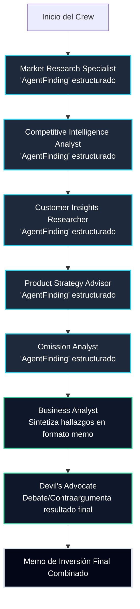
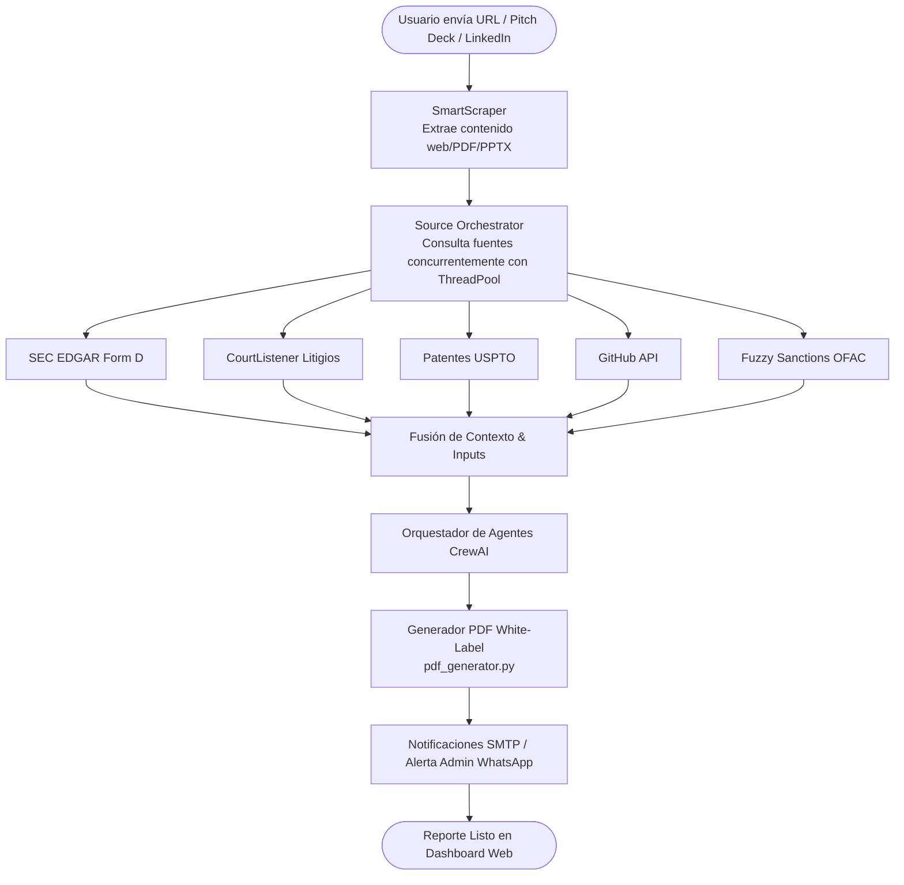

# VerdictIQ — Multi-Agent Venture Capital Due Diligence & Investment Directory

[](https://render.com/deploy?repo=https://github.com/athenacoree/1)

**Sitio Oficial en Producción:** [https://verdictiq.onrender.com/](https://verdictiq.onrender.com/)

**VerdictIQ** (conocido en la arquitectura interna como `VCDueDiligenceAgent`) es la plataforma autónoma líder de auditoría de inversión (*due diligence*) y directorio bidireccional para startups, firmas de Venture Capital, inversores ángeles y syndicates de nivel empresarial.

Desarrollada con **FastAPI**, **SQLAlchemy**, **CrewAI** y **Alpine.js/Tailwind CSS**, VerdictIQ transforma radicalmente la evaluación de startups a partir de URLs públicas, presentaciones Pitch Deck (PDF/PPTX) o perfiles de LinkedIn. Resuelve de manera inteligente el análisis preliminar de alta fidelidad, eliminando procesos manuales lentos, reduciendo costes y entregando memorandos de inversión profesionales en tiempo real.

---

## 🚀 ¿Por qué elegir VerdictIQ? (Ventajas Competitivas y Valor)

VerdictIQ no es un wrapper superficial ni un simple generador de texto. Es un motor de inteligencia financiera de grado institucional diseñado bajo patrones de ingeniería distribuidos y robustos:

### 1. Comité Virtual de Inversión (7 Agentes Especializados con Debate Adversarial)
En lugar de una respuesta plana de IA, VerdictIQ simula un comité de inversión real operado por 7 agentes autónomos de **CrewAI**:
- **Market Research Specialist:** Analiza el tamaño de mercado (TAM/SAM/SOM), tendencias y vientos a favor (*tailwinds*).
- **Competitive Intelligence Analyst:** Evalúa el panorama competitivo, barreras de entrada y ventajas defensivas (*moats*).
- **Customer Insights Researcher:** Audita las reseñas de clientes, retención de cohortes y propuesta de valor.
- **Product Strategy Advisor:** Examina la arquitectura del producto, la escalabilidad técnica y el modelo de monetización.
- **Omission Analyst:** Detecta señales por ausencia, inconsistencias en los datos y riesgos no declarados.
- **Business Analyst:** Sintetiza los hallazgos atómicos en un memorando estructurado con recomendación (*GO*, *CONDITIONAL*, o *NO-GO*).
- **Devil's Advocate (Abogado del Diablo):** Aplica un debate crítico y adversarial para cuestionar rigurosamente la tesis positiva, garantizando un análisis objetivo y libre de sesgos.

### 2. Eficiencia Cognitiva y "Hallazgos Estructurados" de Bajo Consumo
Para garantizar máxima velocidad y optimizar cuotas, los agentes especialistas intercambian esquemas **Pydantic** compactos (`AgentFinding`) con datos atómicos altamente condensados. Únicamente la fase de síntesis redacta la prosa final en formato de memorando técnico humano. Esto reduce drásticamente el consumo de tokens y maximiza la precisión analítica.

### 3. Orquestador Concurrente de 12 Fuentes de Datos de Producción
Mediante su orquestador de fuentes (`source_orchestrator.py`), VerdictIQ consulta en paralelo bases de datos oficiales y públicas (SEC EDGAR Form D, patentes USPTO, litigios en CourtListener, registros globales de OpenCorporates, lista de sanciones OFAC SDN con *fuzzy matching*, GitHub, WHOIS, GDELT, CFPB, etc.), seleccionando dinámicamente qué fuentes consultar según la startup.

### 4. Auditoría de Hype, Clichés y Simulador IC Q&A
Audita la densidad de palabras vacías o exageraciones de marketing (*hype audit*) y calcula un índice % de clichés. Además, genera preguntas incómodas y estratégicas que los socios del fondo deben realizar a los fundadores en reuniones directas.

### 5. Exportación White-Label en PDF y Sincronización Directa con Notion
Genera memorandos descargables en formato PDF con la marca corporativa de la firma (*white-label*) mediante **ReportLab**, incluyendo capturas de pantalla de la startup y enlaces interactivos. Además, permite exportar cualquier reporte directamente a una base de datos de **Notion** configurada con un solo clic.

---

## 📊 Diagramas de Flujo del Sistema

### Pipeline Cognitivo Multi-Agente (7 Agentes)


### Flujo de Ejecución de Análisis y Búsqueda Concurrente


---

## 🛠 Directores y Tipos de Cuentas

- **Cuentas Inversor / Personal:** Acceso completo para iniciar análisis ilimitados, comparar memos de portafolio lado a lado, calibrar métricas de decisión y contactar fundadores en el directorio.
- **Cuentas Empresa / Fundadores:** Acceso dedicado para analizar su propia empresa, subir Pitch Decks, verificar dominio de empresa y publicar su perfil en el directorio de inversión con aprobación de moderación.
- **Directorio de Inversión Abierto:** Un espacio de descubrimiento seguro donde los fundadores pueden exponer su startup a inversores verificados sin compartir correos de manera pública, gestionando alertas de interés (*"Me interesa"*) directamente por correo electrónico.

---

## ⚡ 10 Herramientas Financieras e Interactivas Integradas

VerdictIQ incluye una suite de calculadoras e instrumental financiero para VC e Inversores:
1. **🔥 Calculadora de Runway & Burn Rate:** Proyecta la cantidad de meses de vida financiera restante según caja, burn rate e ingresos recurrentes (MRR).
2. **📊 Valoración EV / ARR:** Estima el valor de empresa (*Enterprise Value*) aplicando múltiplos por sector (SaaS, FinTech, DeepTech, E-Commerce).
3. **🚀 Simulador MoIC / IRR:** Calcula retornos brutos y múltiplos de inversión en escenarios de salida M&A.
4. **📝 Cuestionario para Comité de Inversión (IC):** Guía de preguntas estratégicas para reuniones directas con fundadores.
5. **🌐 Estimador TAM / SAM / SOM:** Calcula mercados atendibles e insumos de captura comercial.
6. **📜 Check Auditoría Term Sheet:** Revisa cláusulas clave (*liquidation preference*, *drag-along*, anti-dilución).
7. **👥 Calculadora Pool ESOP:** Diseña reservas de opciones sobre acciones para empleados clave.
8. **📈 Unit Economics (CAC vs LTV):** Evalúa el valor de vida del cliente frente al costo de adquisición.
9. **🎙️ Script Briefing Audio Builder:** Sintetiza guiones de audio de 60 segundos para revisión previa a comités.
10. **🛡️ Quiz ESG & Cumplimiento:** Audita políticas GDPR, gobernanza de IA y diversidad.

---

## ⚙️ Configuración y Variables de Entorno (.env)

| Variable | Descripción | Valor Predeterminado / Nota |
|---|---|---|
| `DATABASE_URL` | String de conexión a base de datos relacional | `sqlite:///vcdiligence.db` |
| `JWT_SECRET` | Clave secreta para firmar tokens de autenticación JWT | Mandatorio |
| `API_KEY_OPENROUTER` | API Key de OpenRouter, OpenAI o Grok para los LLMs | Requerido para análisis de IA |
| `NOTION_API_KEY` / `NOTION_DATABASE_ID` | Credenciales para integración directa con Notion | Opcional |
| `SMTP_HOST` / `SMTP_PORT` | Configuración del servidor para envío de notificaciones | Opcional |

---

## 🚀 Instalación y Despliegue de Desarrollo

```bash
# 1. Clonar el repositorio
git clone https://github.com/athenacoree/1.git VerdictIQ
cd VerdictIQ

# 2. Instalar dependencias con Poetry y navegadores de Playwright
poetry install
poetry run playwright install chromium

# 3. Configurar archivo de entorno
cp .env.example .env

# 4. Iniciar la aplicación
poetry run python -m vcdiligence.app
```
La aplicación iniciará en `http://localhost:10000`.

---

## 📄 Licencia y Derechos de Autor

**VerdictIQ** está protegido bajo las leyes de propiedad intelectual y licencias correspondientes.

- **Creado y Mantenido por:** **[Marlon Baez Mendez](https://github.com/athenacoree/MARLON-BAEZ-MENDEZ-)**
- **Atribución Original:** Este proyecto incorpora elementos evolucionados basados en el trabajo original de código abierto con licencia MIT de **Suresh Beekhani**. Conservamos y respetamos íntegramente los avisos de autoría original y copyright aplicables.
