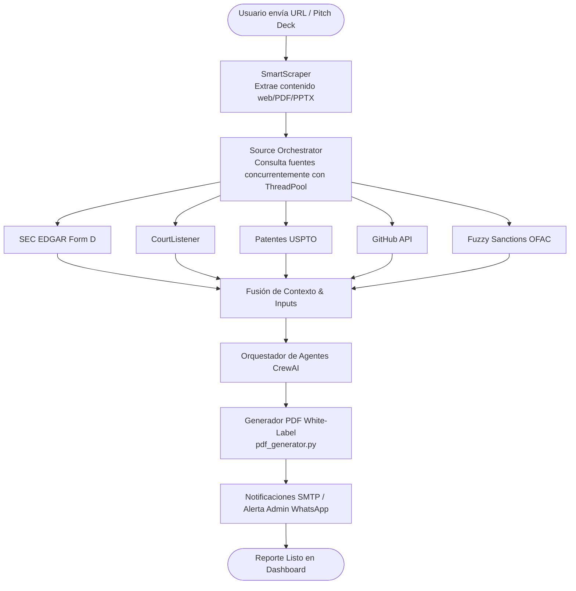

# VerdictIQ — Multi-Agent Venture Capital Due Diligence & Investment Directory

[](https://render.com/deploy?repo=https://github.com/athenacoree/1)

sitio: 
https://verdictiq.onrender.com/
**VerdictIQ** (configurado internamente como `VCDueDiligenceAgent`) es una plataforma autónoma de auditoría (*due diligence*) y directorio bidireccional de inversión para startups y firmas de Venture Capital de nivel empresarial. Construida con **FastAPI**, **SQLAlchemy** y **CrewAI**, permite evaluar de forma profunda startups a partir de URLs públicas, presentaciones Pitch Deck (PDF/PPTX) o perfiles de LinkedIn, resolviendo la necesidad de análisis preliminares de alta fidelidad sin incurrir en procesos manuales lentos.

---

## ⚡ ¿Qué hace diferente a VerdictIQ?

VerdictIQ no es un "simple wrapper" o intermediario superficial de APIs de Inteligencia Artificial. Está diseñado bajo rigurosos patrones de ingeniería de software e infraestructura distribuida:

1. **Pipeline Cognitivo Multi-Agente con Debate Adversarial (7 Agentes)**
   En lugar de una sola llamada masiva a un LLM, VerdictIQ coordina un equipo de 7 agentes especializados de **CrewAI** que actúan como un comité real de analistas de inversión. Los primeros 5 analistas especialistas (Market Research, Competitive Intelligence, Customer Insights, Product Strategy, y Omission Analyst) investigan y extraen hallazgos estructurados. Luego, el **Business Analyst** compila el reporte final, el cual es sometido al riguroso análisis adversarial del agente **Devil's Advocate** (Abogado del Diablo), encargado de cuestionar críticamente las tesis positivas de inversión, aportando un debate de nivel profesional inusual en sistemas automatizados.

2. **Lógica de "Hallazgos Estructurados" de Bajo Consumo**
   Para optimizar costes y evitar la "alucinación" y verbosidad innecesaria de la IA, los agentes especialistas no se pasan prosa larga entre sí. Cada uno genera y transmite un esquema **Pydantic** compacto (`AgentFinding`) con datos atómicos altamente condensados. Únicamente el agente de síntesis final redacta la prosa en formato de memorando humano. Esto reduce drásticamente el consumo de tokens de contexto y maximiza la precisión analítica.

3. **Orquestación Concurrente e Inteligente de 12 Fuentes de Datos**
   El sistema integra un orquestador multi-fuente (`source_orchestrator.py`) que gestiona consultas en paralelo (con un pool de hilos) a bases de datos de producción reales. El orquestador divide las fuentes en *necesarias* y *condicionales*. Basándose en heurísticas de dominio del startup y lo que se va descubriendo, el motor decide inteligentemente cuáles de las 12 fuentes consultar (SEC EDGAR Form D, patentes de la USPTO, litigios en CourtListener, registros de OpenCorporates, estado de sanciones de la OFAC SDN con fuzzy matching, GitHub, WHOIS, etc.), ahorrando recursos de red y cuotas de API.

4. **Resiliencia de Infraestructura Empresarial**
   VerdictIQ incorpora un sistema avanzado de **circuit breaker** en memoria que pausa automáticamente las consultas a fuentes externas caídas o con timeouts para evitar demoras, un **Pool de API Keys con Rotación Automática (`ApiKeyPool`)** que detecta y aísla llaves con fallos consecutivos de cuotas (*rate limits*), y mitigaciones estrictas contra ataques **SSRF** para asegurar que el motor de scraping no sea utilizado de manera maliciosa.

5. **Despliegue Transparente y 100% Reproducible**
   Con la integración de Render Blueprints, puedes desplegar tu propio VerdictIQ totalmente funcional con un solo clic, demostrando que es un sistema transparente, desacoplado y listo para ambientes de producción reales.

---

## 🚀 Despliegue en un Clic (Render Blueprint)

Puedes desplegar una copia completa de VerdictIQ y su base de datos relacional PostgreSQL de forma instantánea en la nube de Render usando el botón superior o el siguiente enlace:

**[Desplegar en Render](https://render.com/deploy?repo=https://github.com/athenacoree/1)**

### Variables de Entorno en el Formulario de Despliegue

Al hacer clic en el botón de despliegue, el formulario de Render te solicitará completar las siguientes variables:

#### 🔴 Obligatorias (Para que el sistema arranque con éxito):
- `JWT_SECRET`: Una cadena de texto segura para firmar y verificar tokens de autenticación JWT. La aplicación fallará explícitamente en el inicio si se deja en blanco.
- `ADMIN_BOOTSTRAP_PASSWORD`: Contraseña para inicializar el usuario administrador predeterminado (`admin@verdictiq.ai`).
- `API_KEY_OPENROUTER`: Tu API Key de OpenRouter (u otro LLM admitido como OpenAI o Grok) para alimentar las llamadas cognitivas de los agentes de IA.

#### 🟢 Opcionales (Configurables para extender funcionalidades):
Si dejas estas variables en blanco, el sistema operará con un **esquema de degradación con gracia**, desactivando la fuente correspondiente de manera segura o utilizando simulaciones seguras sin provocar fallos en el sistema:
- `STRIPE_SECRET_KEY` / `STRIPE_WEBHOOK_SECRET`: Activa y procesa cobros reales de tarjetas de crédito para el sistema de compra de créditos de análisis de startups. Si falta, la pasarela opera en modo de prueba (*Mock*).
- `CRYPTO_API_KEY` / `CRYPTO_WEBHOOK_SECRET`: Activa cobros automatizados con criptomonedas (Coinbase Commerce o NOWPayments). Si falta, opera en modo simulado seguro.
- `BACKUP_S3_ENDPOINT` / `ACCESS_KEY` / `SECRET_KEY` / `BUCKET`: Permite subir y respaldar los logos corporativos y capturas de marca blanca a buckets S3. Si falta, el sistema utiliza codificación Base64 en la base de datos de forma local.
- `COMPANIES_HOUSE_API_KEY`: Habilita la consulta de registros de empresas oficiales del gobierno del Reino Unido. Si falta, se omite esa fuente de datos de manera silenciosa.
- `SMTP_HOST` / `SMTP_PORT` / `SMTP_USERNAME` / `SMTP_PASSWORD`: Habilita el envío automático de PDFs firmados, notificaciones de expiración y alertas de interés de inversores a los fundadores. Si falta, las alertas se registran únicamente en los logs del servidor.

---

## 📊 Diagramas de Flujo del Sistema

### 1. Pipeline Cognitivo Multi-Agente (7 Agentes)
El siguiente diagrama detalla cómo los 5 agentes especialistas analizan de manera secuencial y estructurada la información de la startup devolviendo esquemas Pydantic `AgentFinding`, y cómo confluyen en el Business Analyst y el Devil's Advocate para generar el veredicto final:


### 2. Flujo del Ciclo de Vida de una Petición de Análisis
Este diagrama de secuencia ilustra el flujo de extremo a extremo que experimenta una solicitud de análisis iniciada por un usuario:



---

## 🛠 Directory and Account Types ("Buyer vs Founder")

El sistema separa las cuentas e interacciones en dos flujos completamente aislados:

### 1. Tipos de Cuentas
- **Personal / Investor Accounts:** Diseñado para analistas de VC, ángeles y compradores independientes. Tienen acceso total para iniciar análisis de cualquier startup, comparar múltiples memos, registrar y calibrar sus decisiones de inversión basadas en scores personalizados, y expresar interés en startups del directorio.
- **Empresa / Founder Accounts:** Diseñado para fundadores y ejecutivos de startups. Tienen acceso al análisis enfocado en su propia empresa, la opción de publicarse en el directorio público y renovar la expiración de sus publicaciones.
- **Verificación de Dominio:** Si un fundador se registra con un correo corporativo que coincide con el dominio oficial de su startup (ej. `founder@stripe.com` para `stripe.com`), su cuenta es automáticamente marcada como `verified_domain = true`.

### 2. Directorio Bidireccional y Contacto Seguro ("Me interesa")
- **Consentimiento de Publicación (Opt-In):** Ninguna startup analizada se publica automáticamente. Los fundadores deben configurar explícitamente sus parámetros de listado (categoría, descripción de visibilidad, y decidir si mostrar su score numérico exacto o una insignia cualitativa de rendimiento).
- **Moderación:** Las solicitudes se guardan como `pending_review` y requieren aprobación manual de un administrador para ser visibles públicamente.
- **Lead Generation Seguro:** El correo directo del fundador permanece oculto para evitar spam. Cuando un inversor autenticado hace clic en **"Me interesa"**, el sistema registra la solicitud en `ListingInterest` y despacha un correo de alerta SMTP seguro directamente al fundador con los datos del inversionista interesado.
- **Expiración de Listados:** Los anuncios expiran de manera automática a los 60 días. El sistema envía notificaciones previas por correo con un enlace seguro de renovación rápida de un solo clic.

---

## 🖥️ Interfaz de Usuario (Descripción de Pantallas)

Dado que no es posible desplegar recursos estáticos en vivo durante la compilación del repo, a continuación se describe brevemente la experiencia visual y estructural de cada pantalla principal del sistema:

1. **Pantalla de Login / Registro:** Presenta una interfaz oscura elegante con el mensaje de bienvenida dinámico configurado por el administrador (`welcome_message`), campos para ingresar correo y contraseña, y una opción rápida para registrarse como inversor (personal) o fundador (empresa) con código de invitación/referido si posee.
2. **Dashboard de Análisis (Founder / Investor):**
   - **Para Inversionistas:** Permite buscar startups ingresando el nombre de la compañía, URL directa o LinkedIn. Muestra una lista de análisis completados con su Readiness Score, recomendación de inversión (GO/CONDITIONAL/NO-GO), botones para descargar el reporte PDF, realizar comparación múltiple, y activar monitoreo continuo.
   - **Para Fundadores:** Permite ver los resultados de su propio análisis, configurar su listado público en el directorio de inversión, subir su Pitch Deck o actualizar su perfil de empresa con dominio verificado.
3. **Panel Administrativo (Admin Console):** Secciones dedicadas para que los administradores editen las variables del sistema (`SystemConfig`) en tiempo real (por ejemplo, presupuestos de tokens o switch de pasarela de pagos), ver el estado detallado de las llaves del pool (`api_key_pools`) y sus consecutivas fallas de conexión, moderar testimonios con capturas, examinar logs de errores, y verificar manualmente cuentas de empresas (`verified_by_admin = true`).

---

## ⚙️ Configuración y Variables de Entorno de Desarrollo (.env)

A diferencia de los ajustes de diseño configurables desde el Panel de Admin, estas claves de bajo nivel son requeridas en la inicialización:

| Variable | Descripción | Default / Opción |
|---|---|---|
| `DATABASE_URL` | String de conexión relacional | `sqlite:///vcdiligence.db` |
| `JWT_SECRET` | Clave secreta para firma de tokens JWT (Mandatorio, la app falla si está vacío) | Debe configurarse |
| `ENV` | Modo de entorno del servidor | `development` \| `production` |
| `MIN_USERS_TO_SHOW_STATS` | Límite mínimo de usuarios para visualizar estadísticas de landing | `20` |
| `LISTING_EXPIRY_DAYS` | Vigencia de un listado de inversión pública antes de expirar | `60` |
| `SMTP_HOST` / `SMTP_PORT` | Configuración del servidor de alertas SMTP | `smtp.gmail.com` \| `587` |
| `SMTP_USERNAME` / `SMTP_PASSWORD` | Credenciales de correo de alertas | Opcional |

---

## 🧩 Directory Map and Repository Layout

- `vcdiligence/app.py`: Aplicación FastAPI principal que administra los endpoints REST, políticas de autenticación, moderación, carga de Pitch Decks, webhooks de pagos (Stripe, Crypto) y renderizado de plantillas HTML.
- `vcdiligence/database.py`: Definiciones SQLAlchemy de todas las tablas e índices del sistema. Gestiona la inicialización segura e inyección programática de migraciones Alembic.
- `vcdiligence/system_config.py`: Definición de CONFIG_REGISTRY de configuración dinámica. Métodos seguros para leer (`get_config`) y escribir (`set_config`) valores tipados y validados.
- `vcdiligence/agent_schemas.py`: Contiene el esquema Pydantic estructurado de `AgentFinding` utilizado para restringir el formato de salida JSON de los agentes analistas.
- `vcdiligence/crew.py`: Implementación del pipeline cognitivo CrewAI. Controla los callbacks de registro de consumo de tokens y el loop inteligente de rotación `run_crew_with_rotation()`.
- `vcdiligence/scraper.py`: Adaptador inteligente `SmartScraper` encargado de extraer texto de portales, PDFs de Pitch Decks, presentaciones PPTX y perfiles de LinkedIn.
- `vcdiligence/public_apis.py`: Integración de conectores externos (SEC EDGAR, CourtListener, USPTO, GitHub API) y caché de consultas.
- `vcdiligence/pdf_generator.py`: Generador ReportLab que maquilla el memo técnico final de prosa e incluye branding white-label en el archivo descargable.
- `vcdiligence/tasks.py`: Módulo que consume las tareas asíncronas en segundo plano por medio de FastAPI BackgroundTasks.
- `vcdiligence/monitoring.py`: Worker recurrente de APScheduler que corre análisis de cambios recurrentes, actualiza el estatus de las llaves bloqueadas del pool y expira publicaciones antiguas.
- `vcdiligence/validator.py`: Capa de seguridad que audita SSRF y deniega conexiones a rangos privados/locales de IP.

---

## 🛠 Quick Start & Instalación de Desarrollo

### 1. Clonar el Repositorio e Instalar Dependencias
Asegúrate de contar con Python y Poetry instalado en tu máquina de desarrollo:
```bash
git clone https://github.com/athenacoree/1.git VerdictIQ
cd VerdictIQ
poetry install
poetry run playwright install chromium
```

### 2. Configurar el Archivo de Entorno
Copia la plantilla y configura tu secreto y llaves API correspondientes:
```bash
cp .env.example .env
```
*(Asegúrate de asignar una clave fuerte en `JWT_SECRET` para evitar que la aplicación falle en el arranque)*

### 3. Ejecutar las Migraciones Iniciales de Alembic
El sistema aplicará automáticamente todas las tablas al iniciar la aplicación, pero también puedes ejecutarlas o comprobarlas manualmente mediante:
```bash
poetry run alembic upgrade head
```

### 4. Alimentar Datos de Prueba (Seeding)
Inserta datos iniciales de prueba (usuarios analistas, administradores, configuraciones del CONFIG_REGISTRY y claves API mock):
```bash
poetry run python -m vcdiligence.seed
```

### 5. Iniciar la Aplicación
```bash
poetry run python -m vcdiligence.app
```
La aplicación estará disponible en `http://localhost:10000`.

- **Analista de Prueba:** `analyst@verdictiq.ai` / `analystpassword`
- **Administrador de Prueba:** `admin@verdictiq.ai` / `adminpassword`

---

## 🧪 Pruebas Unitarias e Integración

Para ejecutar la batería completa de pruebas automatizadas y asegurar que no existan regresiones de base de datos o lógica:
```bash
poetry run python -m unittest discover -s tests
```

---

## 🌟 Últimas Mejoras e Integraciones (Actualización 2026)

VerdictIQ se ha robustecido con una serie de características avanzadas de última generación:

### 1. Fuentes estructuradas por sección (Parte 1)
En lugar de amontonar todas las referencias al final del documento, ahora las fuentes de información de mercado, competencia, producto y legales se atribuyen de manera ultra-localizada. Al final de cada subsección relevante del Deep Dive, se renderiza un bloque de citas exacto en formato markdown interactivo:
`**Fuentes de esta sección:** [Nombre de fuente](url) (consultado DD-MM-YYYY)`. Además, las citas son totalmente clickables y funcionales en los documentos PDFs exportados de ReportLab.

### 2. Eliminación de genericidad y duplicidades (Parte 2)
Se ha implementado una rigurosa restricción cognitiva contra términos vagos como *"riesgos regulatorios"* o *"intensa competencia"* sin un sustento concreto (nombre de competidor, cifra o cita textual). El memo técnico se complementa con reglas estrictas de no-repetición de conceptos y profundización por ángulos distintivos (financiero, operativo, etc.).

### 3. Investigación real de fundadores y equipo sin fotos (Parte 3)
El motor de scraping de LinkedIn y DuckDuckGo extrae de forma estructurada los nombres, cargos y URLs de perfil de LinkedIn de los fundadores y equipo directivo de la startup, sin almacenar fotos para mantener la ligereza y cumplimiento de la privacidad, sustituyendo los placeholders genéricos de "falta de información del equipo" por un organigrama real y verificable.

### 4. Capturas de pantalla ligeras y eficientes (Parte 4)
Para no ralentizar ni agotar los recursos del servidor con pesados navegadores headless o procesos de Puppeteer/Playwright que consumen toda la memoria RAM, se ha integrado la API gratuita externa de **Microlink.io**. Esta captura exactamente 4 capturas clave de fuentes diferentes por análisis y las almacena en la nueva tabla `ScreenshotCache` de la base de datos (con validez de 30 días para evitar llamadas redundantes), renderizándolas como una elegante galería de miniaturas tanto en el PDF final como en el Dashboard de resultados web.

### 5. Integración directa con Notion (Parte 5)
Permite exportar al instante los resultados de cualquier reporte directamente como una página estructurada dentro de la base de datos de Notion configurada mediante las variables de entorno `NOTION_API_KEY` y `NOTION_DATABASE_ID`. La UI expone dinámicamente un botón "Enviar a Notion" interactivo si la integración está activa.

### 6. Selector de idioma inteligente en un clic (Parte 6)
Evita los memos con secciones mezcladas en inglés y español. Mediante un selector en el formulario principal, el usuario elige el idioma de destino del análisis (`es` o `en`). Este valor se guarda en la tabla `Task` y se inyecta dinámicamente como instrucción prioritaria a los 7 agentes de CrewAI, quienes traducen, sintetizan y emiten el veredicto íntegramente en el idioma solicitado.

---

## 👨‍💻 Creador y Atribuciones

**VerdictIQ** es desarrollado y mantenido por **[Marlon Baez Mendez](https://github.com/athenacoree/MARLON-BAEZ-MENDEZ-)**.

Este proyecto se originó como un fork de un repositorio de código abierto bajo licencia MIT desarrollado originalmente por **Suresh Beekhani**. Conservamos y respetamos honestamente la autoría de las porciones del código original; sin embargo, el sistema ha sido sustancialmente reescrito, rediseñado y expandido con un conjunto de características avanzadas de nivel empresarial para optimizar consumos, rotar accesos, procesar pagos y robustecer la seguridad global.
